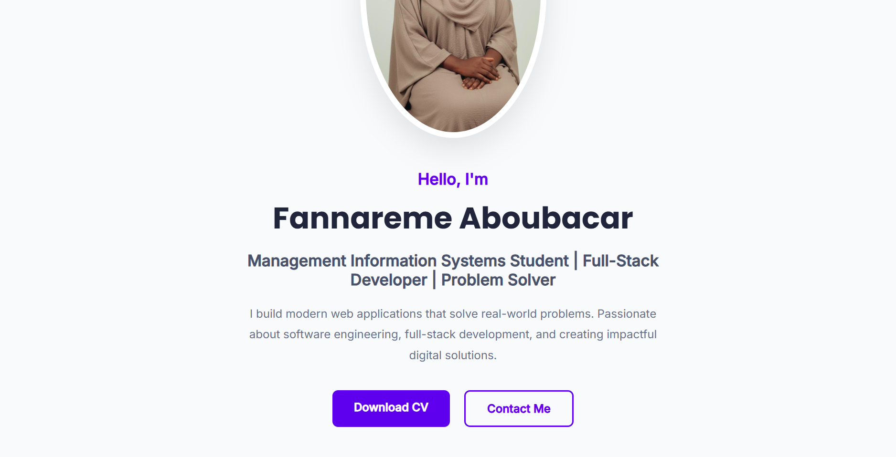
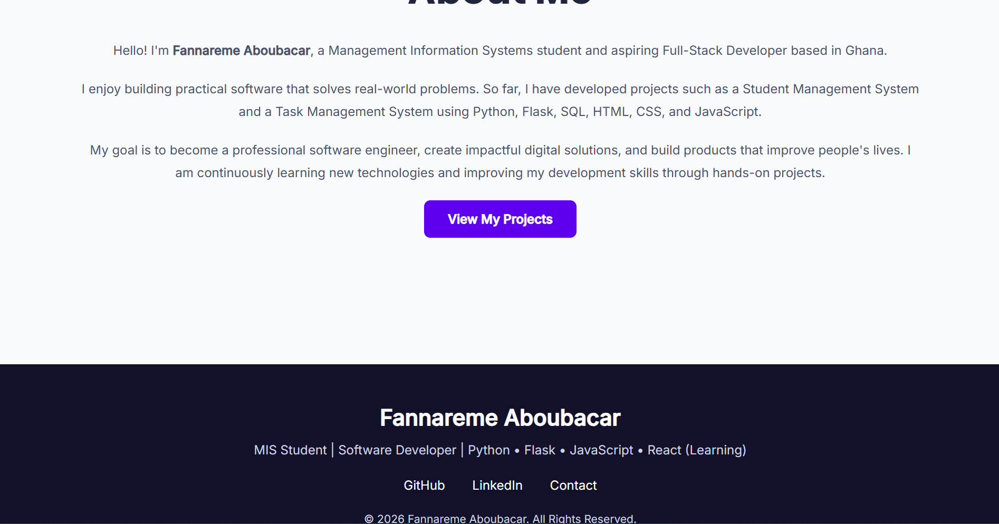
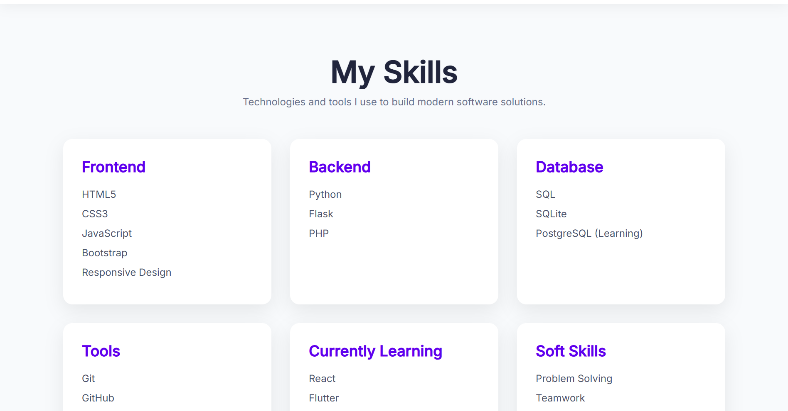
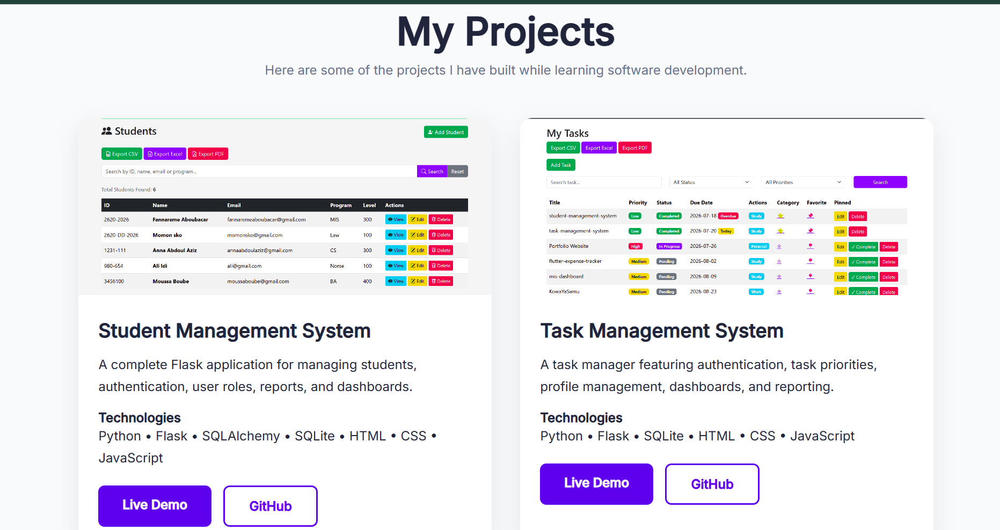
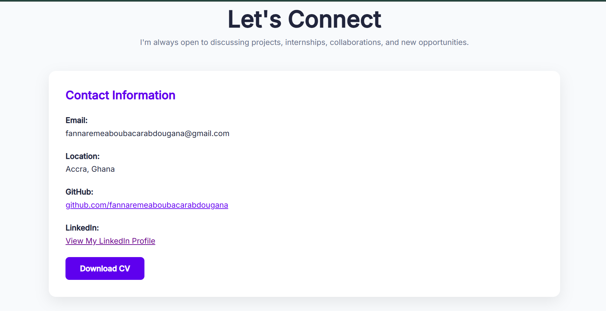

# 🌐 Personal Portfolio Website

A modern, responsive portfolio website built to showcase my skills, projects, and experience as a Software Developer and Management Information Systems (MIS) student.

The website serves as my online professional portfolio, allowing recruiters, clients, and employers to learn more about me, explore my projects, and get in touch.

---

## 🚀 Live Demo

🔗 **Website:** https://fannaremeaboubacarabdougana.github.io/portfolio-website/

---

## 📸 Preview

### Home



### About & Skills



### Projects



### Contact



---

# ✨ Features

- Modern and responsive design
- Mobile-friendly navigation
- Smooth scrolling
- Dark/Light mode
- About Me section
- Skills section
- Projects showcase
- Contact section
- Download CV button
- Social media links
- Clean and organized code

---

# 🛠️ Built With

- HTML5
- CSS3
- JavaScript (ES6)
- Git
- GitHub
- GitHub Pages

---

# 📂 Project Structure

```text
portfolio-website/
│
├── assets/
│   ├── images/
│   └── icons/
│
├── css/
│   └── style.css
│
├── js/
│   └── script.js
│
├── index.html
├── README.md
└── LICENSE
```

---

# 💻 Getting Started

## Clone the repository

```bash
git clone git@github-professional:fannaremeaboubacarabdougana/portfolio-website.git
```

## Navigate into the project

```bash
cd portfolio-website
```

## Open the project

Simply open **index.html** in your browser.

No additional installation is required.

---

# 🎯 Purpose

This project was created to:

- Showcase my software development skills
- Present my completed projects
- Build a professional online presence
- Demonstrate responsive web design
- Practice modern frontend development

---

# 📚 What I Learned

While building this project, I improved my understanding of:

- Responsive web design
- HTML5 semantic elements
- CSS Flexbox & Grid
- JavaScript DOM manipulation
- Dark mode implementation
- UI/UX best practices
- Git & GitHub workflow
- GitHub Pages deployment

---

# 📁 Featured Projects

- 🎓 Student Management System
- ✅ Task Management System
- 🌐 Portfolio Website

More projects will be added as I continue my software development journey.

---

# 🤝 Connect With Me

- GitHub: https://github.com/fannaremeaboubacarabdougana
- LinkedIn: www.linkedin.com/in/fannareme-aboubacar

---

# 📄 License

This project is licensed under the MIT License.

---

## ⭐ Support

If you like this project, consider giving it a ⭐ on GitHub.